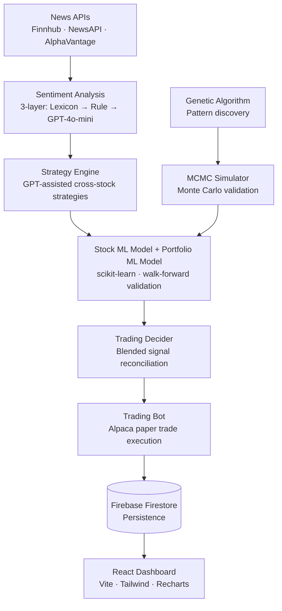

# Stock Portfolio Optimizer

> An AI-powered, self-hosted stock portfolio management system with automated trading, multi-layer sentiment analysis, genetic algorithm pattern discovery, and a real-time React dashboard.


---

## What is this?

Stock Portfolio Optimizer is a fully automated, AI-driven trading pipeline that runs end-to-end — from fetching live news and analysing sentiment, to discovering candlestick patterns via a genetic algorithm, training ML models, making buy/sell decisions, and executing paper trades through Alpaca. A real-time React dashboard synced to Firebase Firestore gives you live visibility into every trade, pattern, strategy, and portfolio metric.

---

## Architecture



---

## Features

### AI & Machine Learning
- **3-Layer Sentiment Engine** — lexicon scoring → rule-based NLP → GPT-4o-mini deep analysis
- **Genetic Algorithm** — discovers candlestick patterns on training data with zero look-ahead bias
- **Monte Carlo / MCMC Simulation** — validates patterns over 1,000 simulated paths before they trade
- **Per-stock ML Model** — scikit-learn gradient boosting for price direction prediction
- **Portfolio ML Model** — regime classification (low / normal / high / crisis) across the whole portfolio
- **Walk-Forward Validation** — rolling train/test splits to prevent overfitting
- **Pattern Refinement** — iterative ML-guided mutation of GA patterns for higher MC composite scores

### Trading & Risk
- **Alpaca Paper Trading** — full order execution with market/limit orders via `alpaca-py`
- **Dynamic Fund Allocator** — risk-adjusted slot allocation with ghost mode for underperforming patterns
- **Earnings Blackout** — automatically suppresses trades around earnings dates
- **Stop-Loss & Drawdown Circuit Breaker** — per-trade and portfolio-level protection
- **Connected Stock Manager** — inter-stock correlation tracking for hedge and pairs strategies
- **Alert Manager** — email notifications for significant portfolio events

### Frontend Dashboard
- **Real-time Firestore sync** — every trade, run, and pattern updates live
- **Pages** — Dashboard · Portfolio · Trading · Charts · Strategies · Trades · Queue · Patterns · Run Pipeline · Settings
- **Candlestick Pattern Viewer** — visual inspection of every discovered GA pattern
- **Stock Mini-Charts & Compare Charts** — lightweight-charts powered visualisations
- **Google Sign-In** — owner-only access enforced at Firestore rules level

### Infrastructure
- Firebase Firestore for all persistence
- Firebase Hosting for the frontend
- Firebase Auth (Google) for authentication
- Cloud Functions (Node.js) for Firebase helpers
- Cron-based scheduled runs via `SchedulerCron.py`
- All secrets managed via `.env` — never committed

---

## Folder Structure

```
Stock-Portfolio-Optimizer/
├── backend/
│   ├── LocalAgent.py          # Main GUI agent — orchestrates the full pipeline
│   ├── TradingBot.py          # Alpaca trade execution
│   ├── TradingDecider.py      # Blended signal decision engine
│   ├── SentimentAnalysis.py   # 3-layer sentiment pipeline
│   ├── StrategyEngine.py      # GPT-assisted strategy generation
│   ├── GeneticAlgorithm.py    # GA pattern discovery
│   ├── Backtester.py          # Walk-forward backtesting engine
│   ├── PortfolioTester.py     # Full end-to-end pipeline runner
│   ├── MCMCSimulator.py       # Monte Carlo / MCMC risk simulation
│   ├── StockMLModel.py        # Per-stock ML price prediction
│   ├── PortfolioMLModel.py    # Portfolio regime ML model
│   ├── DynamicAllocator.py    # Risk-adjusted capital allocation
│   ├── IntelligentFundAllocation.py
│   ├── PersistenceManager.py  # Firestore persistence layer
│   ├── PatternRefiner.py      # ML-guided pattern mutation
│   ├── ConnectedStockManager.py
│   ├── AlertManager.py
│   ├── EarningsBlackout.py
│   ├── BrokerClient.py
│   ├── StockOrderBook.py
│   ├── DailyReviewEngine.py
│   ├── SchedulerCron.py       # Cron-based scheduled runs
│   └── sync_alpaca.py         # Sync Alpaca history → Firestore
├── frontend/
│   ├── src/
│   │   ├── pages/             # Dashboard, Portfolio, Trading, Charts, …
│   │   ├── components/        # StatsCard, CandlestickChart, MiniChart, …
│   │   ├── contexts/          # AuthContext
│   │   ├── hooks/             # useFirestore
│   │   └── firebase.js        # Firebase SDK initialisation
│   └── package.json
├── scripts/
│   └── generate-firestore-rules.js   # Injects OWNER_EMAIL into rules template
├── firestore.rules.template   # Security rules (safe to commit)
├── .env.example               # Copy to .env and fill in keys
├── requirements.txt
└── RunAgent.bat               # One-click launcher (Windows)
```

---

## Prerequisites

| Requirement | Version | Notes |
|---|---|---|
| Python | 3.10+ | 3.13 recommended |
| Node.js | 18+ | For frontend + Firebase CLI |
| Firebase CLI | latest | `npm install -g firebase-tools` |
| Alpaca account | — | Free paper trading at alpaca.markets |
| OpenAI API key | — | For GPT-4o-mini sentiment layer |
| Finnhub API key | — | Free tier sufficient |
| NewsAPI key | — | Free tier (30-day history) |
| Alpha Vantage key | — | Free tier |

---

## Setup & Installation

### 1. Clone the repository
```bash
git clone https://github.com/Haripratiik/Stock-Portfolio-Optimizer.git
cd Stock-Portfolio-Optimizer
```

### 2. Python backend
```bash
python -m venv .venv
# Windows:
.venv\Scripts\activate
# macOS/Linux:
source .venv/bin/activate

pip install -r requirements.txt
```

### 3. Configure secrets
```bash
cp .env.example .env
```
Open `.env` and fill in all API keys (see [Environment Variables](#environment-variables) below).

### 4. Firebase setup
1. Create a project at https://console.firebase.google.com
2. Enable **Firestore** and **Authentication → Google Sign-In**
3. Go to **Project Settings → Service Accounts → Generate New Private Key**
4. Save the JSON file in the project root (filename can be anything — set `FIREBASE_SERVICE_ACCOUNT_PATH` in `.env`)
5. Generate Firestore security rules:
   ```bash
   node scripts/generate-firestore-rules.js
   firebase deploy --only firestore:rules
   ```

### 5. Frontend
```bash
cd frontend
cp .env.example .env        # fill in VITE_FIREBASE_* values from Firebase Console
npm install
npm run dev                 # development server at http://localhost:5173
```

---

## Running the App

### Full pipeline (GUI agent)
```bash
# Windows — double-click or:
RunAgent.bat

# Or directly:
python backend/LocalAgent.py
```

### Frontend dev server
```bash
cd frontend && npm run dev
```

### Scheduled cron runs
```bash
SetupScheduler.bat          # Windows Task Scheduler
# Or:
python backend/SchedulerCron.py
```

### Sync Alpaca positions to Firestore
```bash
SyncAlpaca.bat
# Or:
python backend/sync_alpaca.py
```

---

## Environment Variables

Copy `.env.example` → `.env` and fill in your values.

| Variable | Description | Where to get it |
|---|---|---|
| `OPENAI_API_KEY` | GPT-4o-mini sentiment (Layer 3) | platform.openai.com/api-keys |
| `FINNHUB_KEY` | Historical company news | finnhub.io/register |
| `NEWSAPI_KEY` | Recent headlines (30-day free) | newsapi.org/register |
| `ALPHAVANTAGE_KEY` | Pre-scored sentiment data | alphavantage.co |
| `ALPACA_API_KEY` | Paper trading | app.alpaca.markets |
| `ALPACA_SECRET_KEY` | Paper trading | app.alpaca.markets |
| `ALPACA_BASE_URL` | `https://paper-api.alpaca.markets` | — |
| `OWNER_EMAIL` | Only this email can access the dashboard | Your Google email |
| `FIREBASE_SERVICE_ACCOUNT_PATH` | Path to downloaded JSON key file | Firebase Console → Service Accounts |
| `VITE_FIREBASE_API_KEY` | Firebase Web SDK | Firebase Console → Project Settings → Your apps |
| `VITE_FIREBASE_AUTH_DOMAIN` | Firebase Web SDK | Same as above |
| `VITE_FIREBASE_PROJECT_ID` | Firebase Web SDK | Same as above |
| `VITE_FIREBASE_MESSAGING_SENDER_ID` | Firebase Web SDK | Same as above |
| `VITE_FIREBASE_APP_ID` | Firebase Web SDK | Same as above |
| `VITE_ALLOWED_EMAIL` | Frontend auth guard | Your Google email |

---

## Security

- `.env`, `firestore.rules`, and all Firebase service account JSON files are **git-ignored** and will never be committed
- Firestore rules enforce owner-only access at the database level
- The `firestore.rules.template` (safe to commit) uses a `{{OWNER_EMAIL}}` placeholder — the real address is injected at deploy time
- See [SECURITY.md](SECURITY.md) for full details

---

## Tech Stack

| Layer | Technology |
|---|---|
| Language | Python 3.13, JavaScript (ES2022) |
| ML / Data | scikit-learn, pandas, numpy, yfinance |
| Trading | alpaca-py |
| AI | openai (GPT-4o-mini) |
| Backend DB | Firebase Firestore |
| Auth | Firebase Authentication (Google) |
| Frontend | React 18, Vite, Tailwind CSS |
| Charts | Recharts, Lightweight Charts |
| Hosting | Firebase Hosting |
| Scheduling | Windows Task Scheduler / cron |

---

## Performance

Backtested Sharpe ratios across 6 full pipeline runs (5-year test window, 25-stock portfolio):

| Metric | Value |
|---|---|
| Mean Sharpe ratio | **0.84** |
| Mean backtest return | +116% |
| Win rate range | 54% – 77% |
| S&P 500 Sharpe benchmark | ~0.40 – 0.60 |

> **Note:** Backtest results reflect historical pattern performance with out-of-sample walk-forward validation. Past backtest performance does not guarantee future live results.

---

## Contributing

1. Fork the repo
2. Create a feature branch: `git checkout -b feature/my-feature`
3. Commit your changes: `git commit -m "Add my feature"`
4. Push: `git push origin feature/my-feature`
5. Open a Pull Request
