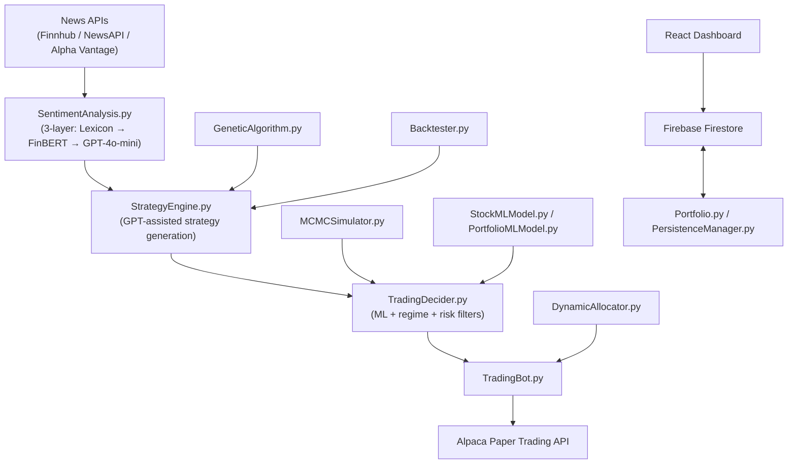

# PortfolioManagement V2

*Self-hosted AI-powered stock portfolio management — from news sentiment to live paper trades.*


---

## 🚀 What is this?

**PortfolioManagement V2** is a self-hosted, AI-powered stock portfolio management system. It combines a Python backend with a React/Vite frontend dashboard to deliver a fully automated trading pipeline:

- **News sentiment** is collected from multiple APIs (Finnhub, NewsAPI, Alpha Vantage), scored through a 3-layer AI pipeline (lexicon → FinBERT → GPT-4o-mini), and fed into a GPT-assisted strategy engine.
- **ML-driven decisions** (scikit-learn price models + market-regime detection + risk filters) drive paper trades executed via the **Alpaca Paper Trading API** — zero real-money risk.
- **Real-time dashboard** backed by **Firebase Firestore**, built with React 18 + Vite + Tailwind CSS, giving live visibility into portfolio state, trades, strategies, and charts.

---

## 🏗️ Architecture



---

## ✨ Feature Highlights

### 🤖 AI & Machine Learning
- 3-layer sentiment engine: rule-based lexicon → FinBERT-style scoring → GPT-4o-mini deep analysis
- GPT-4o-mini assisted strategy generation & evaluation
- scikit-learn ML models for price prediction and market regime detection
- Genetic algorithm for strategy parameter optimisation
- Walk-forward backtesting with Monte Carlo / MCMC risk simulation

### 📈 Trading & Portfolio
- Alpaca paper-trading execution (zero real-money risk)
- Risk-adjusted capital allocation with dynamic re-balancing
- Earnings blackout windows to avoid pre/post-earnings noise
- Inter-stock correlation tracking and position scaling
- Candlestick & technical pattern refinement
- Email alerts for significant portfolio events
- Cron-based scheduled pipeline runs

### 🖥️ Frontend Dashboard
- React 18 + Vite + Tailwind CSS
- Pages: Dashboard, Portfolio, Trading, Charts, Strategies, Trades, Queue, Patterns, Run Pipeline, Settings
- Candlestick pattern viewer, stock mini-charts, compare charts, stats cards
- Real-time Firestore sync

### 🔒 Infrastructure & Security
- Google Sign-In via Firebase Auth (owner-only access)
- Firebase Firestore for all persistence
- Firebase Hosting for the frontend
- Cloud Functions (Node.js) for Firebase helpers
- Firestore security rules generated from a template (owner email never committed)
- All secrets in `.env` (git-ignored); `.env.example` provided

---

## 📁 Folder Structure

<details>
<summary>Click to expand</summary>

```
Stock-Portfolio-Optimizer/
├── backend/
│   ├── LocalAgent.py              # Main GUI agent & pipeline orchestrator
│   ├── SentimentAnalysis.py       # 3-layer sentiment engine
│   ├── StrategyEngine.py          # GPT-assisted strategy generation
│   ├── TradingBot.py              # Alpaca paper-trade execution
│   ├── TradingDecider.py          # Buy/sell decision logic
│   ├── Portfolio.py               # Portfolio state management
│   ├── PersistenceManager.py      # Firebase Firestore persistence layer
│   ├── StockMLModel.py            # Per-stock ML price prediction
│   ├── PortfolioMLModel.py        # Portfolio-level regime model
│   ├── GeneticAlgorithm.py        # Genetic optimisation of strategy params
│   ├── Backtester.py              # Walk-forward backtesting engine
│   ├── PortfolioTester.py         # Portfolio-level backtesting
│   ├── MCMCSimulator.py           # Monte Carlo / MCMC risk simulation
│   ├── DynamicAllocator.py        # Risk-adjusted capital allocation
│   ├── IntelligentFundAllocation.py # Smart fund distribution
│   ├── AlertManager.py            # Email alerts for portfolio events
│   ├── EarningsBlackout.py        # Earnings-proximity blackout logic
│   ├── ConnectedStockManager.py   # Inter-stock correlation tracking
│   ├── StockOrderBook.py          # Order book state management
│   ├── SchedulerCron.py           # Cron-based scheduled runs
│   ├── PatternRefiner.py          # Candlestick/technical pattern sync
│   └── sync_alpaca.py             # Syncs Alpaca trade history to Firestore
├── frontend/
│   ├── src/
│   │   ├── pages/                 # Dashboard, Portfolio, Trading, Charts…
│   │   ├── components/            # Candlestick viewer, mini-charts, stats cards…
│   │   └── firebase.js            # Firebase SDK initialisation
│   ├── .env.example
│   └── vite.config.js
├── functions/                     # Firebase Cloud Functions (Node.js)
├── scripts/
│   └── generate-firestore-rules.js # Generates firestore.rules from template + .env
├── docs/
├── .env.example                   # Root backend env template
├── firestore.rules.template       # Firestore security rules template
├── firebase.json
├── requirements.txt
├── RunAgent.bat                   # Windows shortcut to launch LocalAgent GUI
├── SetupScheduler.bat             # Windows Task Scheduler setup
├── SyncAlpaca.bat                 # Windows shortcut to sync Alpaca trades
└── SECURITY.md
```

</details>

---

## 🔧 Prerequisites

- Python 3.10+ (developed on 3.13)
- Node.js 18+ & npm
- Firebase CLI (`npm install -g firebase-tools`)
- Alpaca paper trading account
- API keys: OpenAI, Finnhub, NewsAPI, Alpha Vantage, Alpaca

---

## ⚙️ Setup & Installation

<details>
<summary>Click to expand step-by-step instructions</summary>

### 1. Clone the repository
```bash
git clone https://github.com/Haripratiik/Stock-Portfolio-Optimizer.git
cd Stock-Portfolio-Optimizer
```

### 2. Create and activate a Python virtual environment
```bash
python -m venv venv
# Windows
venv\Scripts\activate
# macOS / Linux
source venv/bin/activate
```

### 3. Install Python dependencies
```bash
pip install -r requirements.txt
pip install alpaca-py openai
```

### 4. Configure backend environment variables
```bash
cp .env.example .env
# Edit .env and fill in all API keys
```

### 5. Firebase setup
```bash
npm install -g firebase-tools
firebase login
# Generate Firestore security rules (uses OWNER_EMAIL from .env)
node scripts/generate-firestore-rules.js
firebase deploy --only firestore:rules
```

### 6. Install and configure the frontend
```bash
cd frontend
npm install
cp .env.example .env
# Edit frontend/.env and fill in Firebase Web SDK config
cd ..
```

### 7. Install Cloud Functions dependencies
```bash
cd functions
npm install
cd ..
```

</details>

---

## ▶️ Running the App

| Method | Command | Notes |
|---|---|---|
| LocalAgent GUI | `python backend/LocalAgent.py` (or double-click `RunAgent.bat` on Windows) | Full pipeline orchestrator with GUI |
| Frontend dev server | `cd frontend && npm run dev` | Runs at `http://localhost:5173` |
| Scheduled cron | `python backend/SchedulerCron.py` (or run `SetupScheduler.bat` on Windows) | Automates pipeline on a schedule |
| Sync Alpaca trades | `python backend/sync_alpaca.py` (or `SyncAlpaca.bat`) | Syncs Alpaca history to Firestore |
| Deploy frontend | `firebase deploy --only hosting` | Deploys to Firebase Hosting |

---

## 🔑 Environment Variables

<details>
<summary>Backend <code>.env</code></summary>

| Variable | Description | Where to get it |
|---|---|---|
| `OPENAI_API_KEY` | OpenAI API key for GPT-4o-mini sentiment & strategy | [platform.openai.com/api-keys](https://platform.openai.com/api-keys) |
| `OPENAI_REQUEST_DELAY_SECONDS` | Seconds between OpenAI calls (22 for free 3 RPM tier) | Set manually |
| `FINNHUB_KEY` | Finnhub market news API key | [finnhub.io/register](https://finnhub.io/register) |
| `NEWSAPI_KEY` | NewsAPI news aggregator key | [newsapi.org/register](https://newsapi.org/register) |
| `ALPHAVANTAGE_KEY` | Alpha Vantage price & fundamentals key | [alphavantage.co](https://www.alphavantage.co/support/#api-key) |
| `ALPACA_API_KEY` | Alpaca paper trading API key | [app.alpaca.markets](https://app.alpaca.markets/signup) |
| `ALPACA_SECRET_KEY` | Alpaca paper trading secret | [app.alpaca.markets](https://app.alpaca.markets/signup) |
| `ALPACA_BASE_URL` | Alpaca endpoint (`https://paper-api.alpaca.markets`) | Set manually |
| `OWNER_EMAIL` | Your Google account email — used to generate Firestore rules | Your Gmail |
| `USE_STOP_LOSS` | `true`/`false` — enable per-trade stop-loss (default: `true`) | Set manually |
| `USE_WALK_FORWARD` | `true`/`false` — enable walk-forward validation (default: `true`) | Set manually |
| `USE_EARNINGS_BLACKOUT` | `true`/`false` — enable earnings proximity sizing (default: `true`) | Set manually |
| `USE_REGIME_DETECTION` | `true`/`false` — enable regime-based overrides (default: `true`) | Set manually |
| `USE_CORRELATION_ADJUSTMENT` | `true`/`false` — enable correlation-aware position scaling (default: `true`) | Set manually |

</details>

<details>
<summary>Frontend <code>frontend/.env</code></summary>

| Variable | Description | Where to get it |
|---|---|---|
| `VITE_FIREBASE_API_KEY` | Firebase Web SDK API key | Firebase Console → Project Settings |
| `VITE_FIREBASE_AUTH_DOMAIN` | Firebase auth domain | Firebase Console → Project Settings |
| `VITE_FIREBASE_PROJECT_ID` | Firebase project ID | Firebase Console → Project Settings |
| `VITE_FIREBASE_STORAGE_BUCKET` | Firebase storage bucket | Firebase Console → Project Settings |
| `VITE_FIREBASE_MESSAGING_SENDER_ID` | FCM sender ID | Firebase Console → Project Settings |
| `VITE_FIREBASE_APP_ID` | Firebase app ID | Firebase Console → Project Settings |
| `VITE_ALLOWED_EMAIL` | Owner email — only this user can log in | Your Gmail |

</details>

---

## 🔒 Security

- `.env` files are git-ignored and **never committed**
- Firestore security rules are generated from `firestore.rules.template` — the owner email is sourced from your local `.env`, not hardcoded
- `firestore.rules` is git-ignored
- Google Sign-In is restricted to a single owner email on both backend and frontend
- See [SECURITY.md](SECURITY.md) for the vulnerability reporting policy

---

## 🧰 Tech Stack

| Layer | Technologies |
|---|---|
| Backend | Python 3.13, pandas, numpy, scikit-learn, yfinance, firebase-admin, alpaca-py, openai |
| Frontend | React 18, Vite, Tailwind CSS, Recharts, Lightweight Charts, Firebase v10 |
| Database | Firebase Firestore |
| Auth | Firebase Authentication (Google Sign-In) |
| Hosting | Firebase Hosting |
| Functions | Firebase Cloud Functions (Node.js) |
| Trading | Alpaca Paper Trading API |