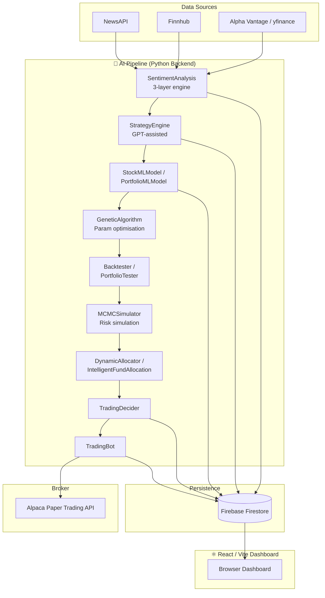

# 📈 PortfolioManagement V2

> **AI-powered, self-hosted stock portfolio management — from news sentiment to live paper trades, fully automated.**

[](https://www.python.org/)
[](https://react.dev/)
[](https://firebase.google.com/)
[](LICENSE)
[](https://github.com/Haripratiik/Stock-Portfolio-Optimizer/stargazers)

---

## 🤔 What is this?

**PortfolioManagement V2** is a self-hosted, AI-driven stock portfolio management system that runs a fully automated trading pipeline — no manual decisions required. It collects financial news, scores sentiment with a three-layer engine (rule-based → FinBERT-style → GPT-4o-mini), generates and back-tests trading strategies, and executes paper trades via the Alpaca API. A React/Vite dashboard powered by Firebase gives you real-time visibility into every part of the pipeline. Everything is owner-only: Google Sign-In via Firebase Auth ensures only you can access your data.

---

## 🏗️ Architecture



---

## ✨ Feature Highlights

<details>
<summary><strong>🤖 AI & Machine Learning</strong></summary>

- **3-layer Sentiment Engine** — rule-based lexicon scoring → FinBERT-style model → GPT-4o-mini deep analysis (`SentimentAnalysis.py`)
- **GPT-assisted Strategy Generation** — automatically drafts, evaluates and refines trading strategies (`StrategyEngine.py`)
- **scikit-learn Price & Regime Models** — per-stock and portfolio-level ML prediction (`StockMLModel.py`, `PortfolioMLModel.py`)
- **Genetic Algorithm Optimisation** — evolves strategy parameters to maximise risk-adjusted returns (`GeneticAlgorithm.py`)
- **Walk-forward Back-testing** — validates strategies on unseen windows before live use (`Backtester.py`, `PortfolioTester.py`)
- **Monte Carlo / MCMC Risk Simulation** — stochastic risk projection and VaR estimation (`MCMCSimulator.py`)
- **Candlestick Pattern Refinement** — AI-assisted technical pattern detection (`PatternRefiner.py`)

</details>

<details>
<summary><strong>💹 Trading & Portfolio Management</strong></summary>

- **Alpaca Paper Trading** — zero-risk order execution via the official Alpaca SDK (`TradingBot.py`)
- **Intelligent Decision Layer** — confidence-weighted buy/sell/hold logic (`TradingDecider.py`)
- **Risk-adjusted Capital Allocation** — dynamic and intelligent fund allocation across positions (`DynamicAllocator.py`, `IntelligentFundAllocation.py`)
- **Earnings Blackout Windows** — suppresses trades in the days around earnings announcements (`EarningsBlackout.py`)
- **Inter-stock Correlation Tracking** — position sizing aware of portfolio correlation (`ConnectedStockManager.py`, `StockOrderBook.py`)
- **Email Alerts** — instant notifications for significant portfolio events (`AlertManager.py`)
- **Alpaca History Sync** — keeps Firestore trade history in sync with Alpaca (`sync_alpaca.py`)
- **Scheduled Cron Runs** — fully automated pipeline on a configurable schedule (`SchedulerCron.py`)

</details>

<details>
<summary><strong>⚛️ React Frontend Dashboard</strong></summary>

- **Pages** — Dashboard, Portfolio, Trading, Charts, Strategies, Trades, Queue, Patterns, Run Pipeline, Settings
- **Candlestick Pattern Viewer** — interactive visual review of detected patterns
- **Stock Mini-charts & Compare Charts** — lightweight-charts powered real-time visuals
- **Stats Cards** — at-a-glance portfolio KPIs
- **Run Pipeline** — trigger a full backend pipeline run directly from the UI

</details>

<details>
<summary><strong>🔧 Infrastructure</strong></summary>

- **Firebase Firestore** — real-time persistence for portfolio state, trades, strategies, and ML results
- **Firebase Hosting** — deploys the React frontend with a single command
- **Firebase Auth (Google Sign-In)** — owner-only access; no accounts to manage
- **Cloud Functions (Node.js)** — serverless Firebase helper functions
- **Firestore Security Rules Template** — owner email injected at deploy time; never committed (`firestore.rules.template`)
- **`.env` / `.env.example`** — all secrets kept out of version control

</details>

---

## 📁 Folder Structure

```
PortfolioManagement V2/
├── backend/                        # Python AI & trading pipeline
│   ├── LocalAgent.py               # Main GUI agent — orchestrates the full pipeline
│   ├── SentimentAnalysis.py        # 3-layer sentiment engine
│   ├── StrategyEngine.py           # GPT-assisted strategy generation & evaluation
│   ├── TradingBot.py               # Alpaca paper-trade execution
│   ├── TradingDecider.py           # Buy / sell / hold decision logic
│   ├── Portfolio.py                # Portfolio state model
│   ├── PersistenceManager.py       # Firebase Firestore read/write helpers
│   ├── StockMLModel.py             # Per-stock ML price/regime prediction
│   ├── PortfolioMLModel.py         # Portfolio-level ML model
│   ├── GeneticAlgorithm.py         # Genetic algorithm for parameter optimisation
│   ├── Backtester.py               # Walk-forward back-testing engine
│   ├── PortfolioTester.py          # Portfolio-level back-testing
│   ├── MCMCSimulator.py            # Monte Carlo / MCMC risk simulation
│   ├── DynamicAllocator.py         # Risk-adjusted capital allocation
│   ├── IntelligentFundAllocation.py# Advanced fund allocation logic
│   ├── AlertManager.py             # Email alert system
│   ├── EarningsBlackout.py         # Blackout windows around earnings dates
│   ├── ConnectedStockManager.py    # Inter-stock correlation tracking
│   ├── StockOrderBook.py           # Per-stock order book management
│   ├── PatternRefiner.py           # Candlestick / technical pattern refinement
│   ├── SchedulerCron.py            # Cron-based scheduled pipeline runs
│   ├── DailyReviewEngine.py        # Daily portfolio review logic
│   ├── BrokerClient.py             # Broker API abstraction layer
│   ├── OpenAIRetry.py              # Resilient OpenAI API wrapper
│   └── sync_alpaca.py              # Sync Alpaca trade history → Firestore
│
├── frontend/                       # React + Vite + Tailwind dashboard
│   ├── src/
│   │   ├── pages/                  # Dashboard, Portfolio, Trading, Charts, …
│   │   ├── components/             # Layout, StatsCard, StockMiniChart, …
│   │   ├── contexts/               # AuthContext (Firebase Auth)
│   │   ├── hooks/                  # useFirestore
│   │   ├── firebase.js             # Firebase SDK initialisation
│   │   ├── App.jsx                 # Router & route definitions
│   │   └── main.jsx                # Vite entry point
│   ├── .env.example                # Frontend env template
│   ├── package.json
│   ├── tailwind.config.js
│   └── vite.config.js
│
├── functions/                      # Firebase Cloud Functions (Node.js)
├── scripts/
│   └── generate-firestore-rules.js # Injects OWNER_EMAIL into Firestore rules
│
├── docs/                           # Extended documentation
├── .env.example                    # Backend env template (safe to commit)
├── firestore.rules.template        # Firestore rules template (safe to commit)
├── firebase.json                   # Firebase project config
├── requirements.txt                # Python dependencies
├── RunAgent.bat                    # Windows: launch LocalAgent GUI
├── SyncAlpaca.bat                  # Windows: run sync_alpaca.py
├── SetupScheduler.bat              # Windows: configure Task Scheduler
└── SECURITY.md                     # Security & secrets policy
```

---

## ✅ Prerequisites

| Requirement | Version | Notes |
|-------------|---------|-------|
| Python | 3.10+ | 3.13 recommended |
| Node.js | 18+ | Required for frontend & Firebase CLI |
| Firebase CLI | latest | `npm install -g firebase-tools` |
| Alpaca account | — | [Sign up for paper trading](https://app.alpaca.markets/signup) |
| OpenAI account | — | [Get API key](https://platform.openai.com/api-keys) |
| Finnhub account | — | [Register](https://finnhub.io/register) |
| NewsAPI account | — | [Register](https://newsapi.org/register) |
| Alpha Vantage key | — | [Get key](https://www.alphavantage.co/support/#api-key) |
| Firebase project | — | [Create project](https://console.firebase.google.com/) |

---

## 🚀 Setup & Installation

### 1 — Clone the repository

```bash
git clone https://github.com/Haripratiik/Stock-Portfolio-Optimizer.git
cd Stock-Portfolio-Optimizer
```

### 2 — Python backend

```bash
# Create and activate a virtual environment
python -m venv venv
source venv/bin/activate          # Windows: venv\Scripts\activate

# Install Python dependencies
pip install -r requirements.txt

# Install additional packages not yet in requirements.txt
pip install alpaca-py openai finnhub-python newsapi-python transformers torch
```

### 3 — Configure backend secrets

```bash
cp .env.example .env
# Open .env and fill in all API keys (see Environment Variables section below)
```

### 4 — Firebase setup

```bash
# Log in to Firebase
firebase login

# Generate Firestore security rules (injects your OWNER_EMAIL from .env)
node scripts/generate-firestore-rules.js

# Deploy Firestore rules
firebase deploy --only firestore:rules
```

> ⚠️ **Never commit `firestore.rules`** — it contains your email address.

### 5 — Frontend

```bash
cd frontend
cp .env.example .env          # Copy frontend env template
# Edit frontend/.env and fill in your Firebase config values

npm install
```

---

## ▶️ Running the App

### LocalAgent GUI (full pipeline)

```bash
# From the repo root, with venv activated
python backend/LocalAgent.py
```

This launches the Tkinter-based GUI agent that orchestrates the entire pipeline: sentiment analysis → strategy generation → ML inference → trade decisions → Alpaca execution.

### Frontend dev server

```bash
cd frontend
npm run dev
# Open http://localhost:5173 in your browser
# Sign in with the Google account matching your OWNER_EMAIL
```

### Scheduled cron run (headless)

```bash
# Run the full pipeline once without the GUI
python backend/SchedulerCron.py

# Windows: use the provided batch file to register a Task Scheduler job
SetupScheduler.bat
```

### Sync Alpaca trade history

```bash
python backend/sync_alpaca.py
# Windows shortcut:
SyncAlpaca.bat
```

---

## 🔑 Environment Variables

### Backend (`.env`)

| Variable | Description | Where to get it |
|----------|-------------|-----------------|
| `OPENAI_API_KEY` | OpenAI API key for GPT-4o-mini | [platform.openai.com](https://platform.openai.com/api-keys) |
| `FINNHUB_KEY` | Finnhub market data & news key | [finnhub.io](https://finnhub.io/register) |
| `NEWSAPI_KEY` | NewsAPI headlines key | [newsapi.org](https://newsapi.org/register) |
| `ALPHAVANTAGE_KEY` | Alpha Vantage price data key | [alphavantage.co](https://www.alphavantage.co/support/#api-key) |
| `ALPACA_API_KEY` | Alpaca paper trading API key | [app.alpaca.markets](https://app.alpaca.markets/signup) |
| `ALPACA_SECRET_KEY` | Alpaca paper trading secret key | Same as above |
| `ALPACA_BASE_URL` | Alpaca endpoint (`https://paper-api.alpaca.markets`) | Same as above |
| `OWNER_EMAIL` | Your Google email — injected into Firestore rules | Your Google account |

#### Optional pipeline toggles

| Variable | Default | Description |
|----------|---------|-------------|
| `USE_STOP_LOSS` | `true` | Enable per-trade stop-loss |
| `USE_WALK_FORWARD` | `true` | Enable walk-forward back-test validation |
| `USE_EARNINGS_BLACKOUT` | `true` | Suppress trades near earnings dates |
| `USE_REGIME_DETECTION` | `true` | Regime-based position size overrides |
| `USE_CORRELATION_ADJUSTMENT` | `true` | Correlation-aware position scaling |
| `OPENAI_REQUEST_DELAY_SECONDS` | `22` | Delay between OpenAI calls (lower for paid tier) |

### Frontend (`frontend/.env`)

| Variable | Description |
|----------|-------------|
| `VITE_FIREBASE_API_KEY` | Firebase Web API key |
| `VITE_FIREBASE_AUTH_DOMAIN` | Firebase Auth domain |
| `VITE_FIREBASE_PROJECT_ID` | Firebase project ID |
| `VITE_FIREBASE_STORAGE_BUCKET` | Firebase storage bucket |
| `VITE_FIREBASE_MESSAGING_SENDER_ID` | Firebase messaging sender ID |
| `VITE_FIREBASE_APP_ID` | Firebase app ID |

All values come from your Firebase project's **Project Settings → Your apps → SDK setup and configuration**.

---

## 🔒 Security

This project is designed so that **no secrets are ever committed to version control**.

| What | Why it's safe |
|------|--------------|
| `.env` | Git-ignored; contains all backend API keys |
| `frontend/.env` | Git-ignored; contains Firebase config |
| `firestore.rules` | Git-ignored; generated at deploy time from template |
| `*-firebase-adminsdk-*.json` | Git-ignored; service account keys |
| `frontend/dist` | Git-ignored; built files may inline env vars |

See [SECURITY.md](SECURITY.md) for the full security policy, including how to handle previously committed secrets.

---

## 🤝 Contributing

Contributions are welcome! Please follow these steps:

1. Fork the repository
2. Create a feature branch: `git checkout -b feature/your-feature-name`
3. Commit your changes: `git commit -m "feat: add your feature"`
4. Push to your fork: `git push origin feature/your-feature-name`
5. Open a Pull Request against `main`

Please ensure:
- No secrets or credentials are included in your PR
- Code follows the existing style of each module
- New backend modules load secrets from `.env` via `os.getenv()`

---

## 📄 License

This project is licensed under the **MIT License**.

```
MIT License

Copyright (c) 2024 Haripratiik

Permission is hereby granted, free of charge, to any person obtaining a copy
of this software and associated documentation files (the "Software"), to deal
in the Software without restriction, including without limitation the rights
to use, copy, modify, merge, publish, distribute, sublicense, and/or sell
copies of the Software, and to permit persons to whom the Software is
furnished to do so, subject to the following conditions:

The above copyright notice and this permission notice shall be included in all
copies or substantial portions of the Software.

THE SOFTWARE IS PROVIDED "AS IS", WITHOUT WARRANTY OF ANY KIND, EXPRESS OR
IMPLIED, INCLUDING BUT NOT LIMITED TO THE WARRANTIES OF MERCHANTABILITY,
FITNESS FOR A PARTICULAR PURPOSE AND NONINFRINGEMENT. IN NO EVENT SHALL THE
AUTHORS OR COPYRIGHT HOLDERS BE LIABLE FOR ANY CLAIM, DAMAGES OR OTHER
LIABILITY, WHETHER IN AN ACTION OF CONTRACT, TORT OR OTHERWISE, ARISING FROM,
OUT OF OR IN CONNECTION WITH THE SOFTWARE OR THE USE OR OTHER DEALINGS IN THE
SOFTWARE.
```